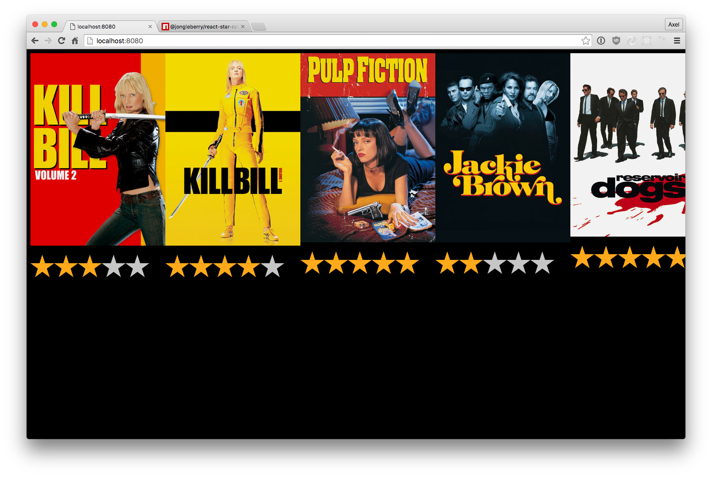

# Treexor Javascript training

* [Intro](#intro)
* [Javascript gotchas](#javascript-gotchas)
* [Testing](#testing)
* [ES6/ES2015](#es6es2015)
* [Functional programming](#functional-programming)
* [Async programming](#async-programming)
* [Webpack](#webpack)
* [Landing Page Optimization](#landing-page-optimization)
* [Flexbox](#flexbox)
* [React](#react)
* [React Router](#react-router)
* [Redux](#redux)
* [React Native](#react-native)


## Intro

Javascript es no es únicamente jQuery.


Gracias a su popularidad debida a que es el lenguaje de la web, su uso se ha extendido a multiples plataformas:
* Aplicaciones de servidor: [NodeJS](https://nodejs.org/)
* Aplicaciones móviles: [React Native](https://facebook.github.io/react-native/)
* Aplicaciones de escritorio: [Electron](http://electron.atom.io/)
* Robotics and IoT: [Johnny Five](http://johnny-five.io)

## Requirements

* NodeJS: https://github.com/creationix/nvm

## Javascript gotchas

JavaScript tiene sus [partes buenas](http://www.amazon.com/JavaScript-Good-Parts-Douglas-Crockford/dp/0596517742) y sus partes malas, por eso es importante que conozcamos cómo funciona el lenguaje.


### == vs ===

La principal diferencia entre el operador `==` y `===` es que el primero realiza conversión de tipos

````js
1 == 1     // true
1 === 1    // true
1 == '1'   // true
1 === '1'  // false
````

## Scope

Por defecto, el scope de las variables es global. Se definen en un objeto global, en que en el caso del navegador se llama `window`.

````js
a = 20;
console.log(a); //20
console.log(window.a); // 20
````

Si utilizamos `var` la variable se define en el ámbito de la función donde está contenido.

````js
var a = 'global';

function printLocal () {
    var a = 'local';
    console.log(a);
}

console.log(a); //global
printLocal(); //local
````

A diferencia de otros lenguajes de programación como Java, los bloques no definen un scope.

````js
function fn() {
    if(true) {
        var a = 10;
    }
    for(i = 0; i < 20; i++) {
        var b = i;
    }
    console.log(a);
    console.log(b);
}
fn();
// 10
// 19
````

Siempre debemos definir las variables utilizar `var` para evitar efectos colaterales al modificar variables global sin darnos cuenta

````js
var a = 'global';

function printLocal () {
    a = 'local';
    console.log(a);
}

console.log(a); //global
printLocal(); //local
console.log(a); //local
````

Para evitar la utilización de variables globales se suelen utilizar las 'self-invoking functions'. La forma de definirlas es

````js
(function () {
    var a = 'this is not global';
    console.log(a);
})();
````

Definiendo una función que se llama a si misma estamos consiguiendo definir un ámbito para que la variable a no esté definida en el scope global.

Es posible que cuando veas código de alguna librerías veas a que las 'self-invoking functions' le pasan parámetros, por ejemplo:

````js
(function( window, $, undefined ) {
    // code
})(window, jQuery);
````

## Funciones con número de parámetros variables

Todas las función definen dos parámetros por defecto: `this` y `arguments`. `arguments` contiene todos los parámetros que se han especificado al invocar una función, permitiendo implementar funciones con número de parámetros variables.


````js
function multipleArgs () {
    console.log(arguments);
}

multipleArgs(1, 2, 3, 4);
multipleArgs(1, 2, 3, 4, 5, 6);
````

Debido a un fallo de diseño, `arguments` es una variable de tipo array, pero no es realmente un array. Tiene una property length y se pueden acceder a los elementos con [], pero no tiene todos los métodos de un array.

````js
function multipleArgs () {
    console.log(arguments[0], arguments[1]);
    console.log(arguments.length);
    console.log(arguments.slice); //undefined
}

multipleArgs(1, 2, 3, 4);
multipleArgs(1, 2, 3, 4, 5, 6);
````

Si queremos convertir la variable `arguments` a un array podemos utilizar

````js
var args = Array.prototype.slice.call(arguments);
````

## First-class function

JavaScript soporta pasar como parámetros y devolver funciones.

Este es el modo imperativo de imprimir los elementos de un array.
````js
function printElements (array) {
    for (var i = 0; i < array.length ; i++) {
        console.log(array[i]);
    }
}
printElements([1, 2, 3]);
````

Si hicieramos una implementación funcional

````js
function forEach (array, fn) {
    for (var i = 0; i < array.length; i++) {
        fn(array[i]);
    }
}

function print(element) {
    console.log(element);
}

forEach([1, 2, 3], print);
````

En la implementación funcional estamos abstrayendo el recorrer un array en la función `forEach`, que recibe como segundo parámetro una función que es la que llamará en cada una de las iteraciones.

Las funciones como parámetros son clave en la programación asíncrona. Es muy común que las funciones que realizan tareas asíncronas reciban como parámetro una función que se invocará cuando haya terminado la tarea asíncrona. A este tipo de parámetro se le llama callbacks.

````js
function delayedAlert(callback) {
    setTimeout(function () {
        alert('hello');
        callback();
    }, 2000);
    console.log('finish delayed alert');
}

delayedAlert(function () {
    console.log('callback!');
});

// finish delayed alert
// Alert
// callback!
````

Las funciones pueden devolver funciones

````js
function counter() {
    var count = 0;
    return function() {
        console.log(count++);
    }
}
var count = counter();
count();
count();
count();
````

## Closure

Las funciones pueden acceder a todas las variables de la función donde fueron definidas (excepto this y arguments).

````js
function fn() {
  var name = "js-training";
  function innerFn() {
      console.log(name);
  }
  innerFn();
}
fn();
````

Un caso más interesante es cuando la inner function tiene un ciclo de vida mayor que la función que la englobal

````js
function counter() {
    var count = 0;
    return function() {
        console.log(count++);
    }
}
var count = counter();
count();
count();
count();
````

Este es un mecanismo que permite definir variables privadas, como la variable `count`.

Esta [herramienta](http://daniellmb.github.io/JavaScript-Scope-Context-Coloring/example/scope-coloring.html) hace un resaltado de sintaxis del código en función del scope.

## What it is "this"?

El parámetro `this` es muy importante en programación orientada a objetos y su valor está determinado por el patrón de invocación utilizado.
Existen cuatro patrones de invocación distintos en javascript: Method invocation pattern, function invocation pattern, constructor invocation pattern y apply invocation pattern.

##### Method invocation pattern

````js
var myObject = {
    increment : function () {

    }
}
myObject.increment();
// this == myObject
````

##### Function Invocation Pattern

````js
function add(a, b) {
    return a + b;
}
var sum = add(3, 4); // this == global object -> window
````

##### Constructor Invocation Pattern

Javascript es un lenguaje con herencia de prototype, esto quiere decir que un objeto puede heredar properties directamente de otro objeto.
Cuando una función se invoca utilizando el prefijo new, se crea un nuevo objeto y el valor de this apuntará a ese nuevo objeto.

````js
var Quo = function (string) {
    this.status = string;
};
Quo.prototype.get_status = function (  ) {
    return this.status;
};
var myQuo = new Quo("confused");
````

##### Apply Invocation Pattern

Los métodos `apply` y `call` permite invocar una función especificandole el valor que debe tener el this. La diferencia entre las dos funciones que la primera recibe un array con los parámetros mientras que la segunda recibe un número de parámetros variables.

````js
var parameters = [3, 4];
var sum = add(3, 4);

var thisObject = {};

var sum = add.apply(thisObject, [3, 4]);
var sum = add.call(thisObject, 3, 4);
````

## Problemas con this

El principal problema con this, es no saber qué valor tiene en cada momento.

````js
function counter() {
    var count = 0;
    return function() {
        console.log(count++);
    }
}
var count = counter();
count();
count();
````

Supongamos que queremos almacenar la variable `count` en this.

````js
var counter = {
    create : function () {
        this.count = 0;
        return function() {
            console.log(this.count++);
        }
    }
}
var count = counter.create();
count();
count();
````

Este código no va a funcionar. ¿Cual es el problema? El valor del this no es el mismo en las dos funciones.
Si quisieramos hacer esto, podríamos definir una variable local que almacenara el valor del this.

````js
var counter = {
    create : function () {
        this.count = 0;
        var self = this;
        return function() {
            console.log(self.count++);
        }
    }
}
var count = counter.create();
count();
count();
````

## Testing

Para realizar los ejercicios vamos a hacer testing. De esta forma vamos a comprobar si nuestro código es correcto o no. Para haer testing vamos a utilizar 3 librerías:

* Mocha: Test runner
* Chai: Assertion library
* Sinon: Mock library


Una suite de test comienza con la llamada a la función `describe`. Cada uno de los test se definen llamando a la función `it`. Por ejemplo:

````js
describe('MiClass', function(){
    it('should have an amazing feature', function(){
        //assertions
    })
})
````

En los bloques describe se especifican funcionalidades y en los bloques it se especifica qué comportamiento debería tener. Los bloques describe se pueden anidar.

````js
describe('MiClass', function(){
    describe('amazing feature', function () {
        it("should works only if it's monday", function () {
            //assertions
        });
    })
})
````

Si queremos ejecutar un código antes de cada bloque `it` podemos utilizar la función `beforeEach`.

````js
describe('MiClass', function(){
    beforeEach(function () {

    })

    it("should return monday if it's monday", function () {
        //assertions
    });

    it("should return tuesday if it's tuesday", function () {
        //assertions
    });
})
````

Para definir las assertions vamos a utilizar chai. Estos son algunos de los métodos disponibles, en la [documentación](http://chaijs.com/api/bdd/) puedes consultar el resto.

````js
expect(foo).to.equal('bar');
expect('hello').to.equal('hello');
expect(foo).to.eql({ bar: 'baz' }); //deep equal
expect('test').to.be.a('string');
expect([1,2,3]).to.include(2);
expect(true).to.be.true;
expect(undefined).to.be.undefined;
expect(fn).to.throw(Error);
````

## Test doubles con SinonJS

[Sinon.js](http://sinonjs.org/docs/) nos provee tres tipos distintos de dobles para tests:

* Spy
* Stub
* Mocks

Los **Spy** graban los argumentos con que fue llamada una función y el valor de retorno. Nos permite hacer cosas como:


```js
 var callback = sinon.spy();
PubSub.subscribe("message", callback);
PubSub.publishSync("message");
expect(callback.called).to.be.true;

var spy = sinon.spy(obj, "method");
obj.method("arg1");
expect(spy.getCall(0).args[0]).to.equal("arg1")
```

Los *Stubs* se comportan como Spy pero permiten sustituir la función que están espiando.

```js
var stub = sinon.stub(obj, "method", function () {
    return "the method was replaced"
});
var result = obj.method();
expect(stub.called).to.be.true;
expect(result).to.equal("the method was replaced");
```

Los *Mocks* se comportan Stubs pero harán fallar los tests si no se usan como estaban programados.

```js
var mock = sinon.mock(obj, "method", function () {
    return "the method was replaced"
});
var result = obj.method();
mock.verify();
```

# Ejercicios

#### Map

La función map permite manipular los elementos de un array. Se parece a la función `forEach` que vimos anteriormente, pero `map` almacena el valor de la evaluación de todas las funciones mientras itera.

````js
it("map", function () {
    var multiplyByTwo = function (a) {
        return a * 2;
    };
    expect(map([1, 2, 3], multiplyByTwo)).to.eql([2, 4, 6]);
});
````

#### Curry

La función curry permite hacer una aplicación parcial de los elementos de una función.

````js
it("curry", function () {
    function add (x, y) {
        return x + y;
    }
    var inc = curry(add, 1);
    expect(inc(10)).to.equal(11);
    expect(inc(23)).to.equal(24);
});
````

#### Memoize

La función memoize permite crear una cache de las ejecuciones de una función. Cuando se invoca una función se almacena el resultado en una cache. Si la función se vuelve a llamar con los mismos parámetros, el resultado se obtiene de la cache en lugar de evaluar de nuevo la función.

````js
it("Memoize", function () {
    var multiplyByTwo = function (a) {
        return a * 2;
    };
    var multiplyByTwoSpy = sinon.spy(multiplyByTwo);
    var multiplyByTwoMemoized = memoize(multiplyByTwoSpy);

    expect(multiplyByTwoMemoized(1)).to.equal(2);
    expect(multiplyByTwoMemoized(1)).to.equal(2);

    expect(multiplyByTwoSpy.calledOnce).to.be.true;
});
````

## ES6/ES2015

ES6 añade muchas funcionalidades muy interesantes al lenguaje

https://github.com/lukehoban/es6features#readme

Muchas de estas funcionalidades ya están implementadas en la [última versión de NodeJS](http://node.green/).

Si queremos utilizar estas funcionalidades en el navegador, vamos a tener que utilizar un compilador que genere código compatible con todos los navegadores. Por ejemplo [Babel](https://babeljs.io/).

En la sección de build tools veremos como integrarlo.

## Functional programming

¿Podemos considerar JavaScript como un lenguaje funcional? Pues depende de la definición que utilicemos de lenguaje funcional. Si definimos un lenguaje funcional como aquel que tiene first class functions (las funciones se pueden utilizar como parámetros y como valores a devolver), entonces podemos considerar JavaScript como un lenguaje funcional. En cambio si incluimos en la definición conceptos como inmutabilidad o pattern matching, entonces JavaScript no es un lenguaje funcional.

> Functional programming is the use of functions that transform values into units of ab‐ straction, subsequently used to build software systems.


### ¿Por qué la programación funcional es importante?

¿Podrías decir a simple vista qué hace este código?

```js
var array = [1, 2, 3];
var results = [];
for (var i = 0; i < array.length; ++i) {
  var value = (array[i] * array[i]) + 1;
  if (value % 2 === 0) {
    results.push(value);
    if (results.length === 1) {
      break;
    }
  }
}
```

Vamos a reescribir el código de una forma funcional

```js
const array = [1, 2, 3];
const result = _.chain(array)
 .map(square)
 .map(inc)
 .filter(isEven)
 .head(1)
 .value();

const square = i => i * i;
const inc = i => i +1;
const isEven = i => i %2 === 0;

```

Tenemos un trozo de código más compacto y legible. Además hemos creados algunas funciones como square o inc que podremos reutilizar

## Ejercicio


```js
const clients = [
  {firstName: "Princess", lastName: "Hernández", balance: 50},
  {firstName: "Darth", lastName: "Vader", balance: -20},
  {firstName: "Luke", lastName: "Skywalker", balance: -30},
  {firstName: "Han", lastName: "Solo", balance: 100}
];

describe("functional", () => {

  it("should return the full name of client with balance < 0", () => {
    expect(badClients(clients)).to.eql(["Darth Vader", "Luke Skywalker"])
  });

});
```

## Async programming

La programación asíncrona ha sido una de las claves del éxito y la rapidez de NodeJS. El modelo de programación asíncrona de javascript es monohilo, tanto en el navegador como en NodeJS. Esto quiere decir que dos códigos javascript no se pueden ejecutar simultáneamente, se tienen que ejecutar uno después del siguiente. Esto al principio puede resultar chocante: ¿Cómo un servidor web que debe atender muchas peticiones simultáneas puede ser monohilo? La clave está en el EventLoop.


Los navegadores también tienen un único hilo de ejecución. Aunque esto está cambiando con la introducción de los [Web Workers](http://www.html5rocks.com/en/tutorials/workers/basics/).

Las operaciones asíncronas más comunes cuando estamos trabajando en la web son

* `setTimeout(cb, ms)`
* `setInterval(cb, ms)`
* Peticiones ajax

En node, la mayor parte de la api trabaja con funciones asíncronas. Por ejemplo para leer un fichero en node

```js
const fs = require("fs");
fs.readFile("file", (err, data) => {
  if (err) console.error(err);
  console.log(data);
});
```

El principal problema con los callbacks es lo que se denomina el callback hell. Supongamos que tenemos que hacer un proceso que lea varios ficheros y luego haga algún procesamiento.


```js
function processMultipleFiles(cb) {
    fs.readFile('file1.txt', function (err, file1) {
      if (err) cb(err);
      fs.readFile('file2.txt', function (err, file2) {
        if (err) cb(err);
        fs.readFile('file3.txt', function (err, file3) {
          if (err) cb(err);
          fs.readFile('file4.txt', function (err, file4) {
            if (err) cb(err);
            fs.readFile('file5.txt', function (err, file5) {
              if (err) cb(err);
              process(file1, file2, file3, file4, file5);
            });
          });
        });
      });
    });
}
```

Lo cierto es que no es un código sencillo de mantener. Además el manejo de los errores es propenso errores.

#### Ejercicio

Piensa en una forma ejecutar dos métodos asíncronos y esperar que los dos hayan terminado.


### Promises

ES6 trae una nueva abstracción para trabajar con código asíncrono, las Promises. Una promesa representa una operación que no se ha completado todavía, pero que se va a completar en el futuro. Las promesas permiten añadir manejadores que se ejecutaran la promesa haya sido resuelta (con éxito o con error).


Para crear una promesa

```js
function timeoutPromise(ms) {
    return new Promise((resolve, reject) => {
        setTimeout(resolve, 500);
    });
}
```

A la hora de ejecutar una promesa, debemos añadir los manejadores para poder reaccionar al resultado de la promesa

```js
    timeoutPromise(500)
      .then(() => console.log("success"))
      .catch(() => console.error("error"));
```

Las promesas se pueden encadenar para obtener una ejecución secuencial

```js
    timeoutPromise(500)
      .then(() => timeoutPromise(1500))
      .then(() => console.log("executed after 2000ms"))
      .catch(() => console.error("error"));
```

En este caso, el método catch se ejecutará si alguna de las dos promesas falla.

Si queremos ejecutar varías promesas en paralelo. Podemos utilizar el método `all`.

```js
Promise.all([timeoutPromise(500), timeoutPromise(1000)])
    .then(() => console.log("executed after 1000ms"));
```

Las promesas forman parte del standard, pero todavía no están implementadas en todos los navegadores. Por lo tanto es posible que te haga falta utilizar un polyfill. Una librería que además añade funcionalidades muy útiles para trabajar con promesas es [bluebird](http://bluebirdjs.com/).

El código equivalente al ejemplo de leer varios ficheros en node, utilizando promesas sería el siguiente.


```js
const fs = require("fs");
const Promise = require("bluebird");

function readFilePromise(filename) {
  return new Promise((resolve, reject) => {
    fs.readFile(filename, (err, content) => {
        if (err) return reject(err);
        resolve(content);
    })
  });
}

function processMultipleFiles() {
    const files = ["file1.txt", "file2.txt", "file3.txt", "file4.txt", "file5.txt"];
    return Promise.map(files, readFilePromise).then(processFiles);
}
```

El método `readFilePromise` utiliza un patrón muy común que permite convertir un método que trabaja con callbacks en un método que devuelve una promesa. Bluebird también tiene una implementación de este método `Promise.promisify`.


# Ejercicio de promesas

`fetch` es un nuevo método que están implementado los navegadores para trabajar con peticiones http. Para usarlo en NodeJS nos hace falta utilizar la librería `isomorphic-fetch`.

```js
npm install --save isomorphic-fetch
```

```js
require('isomorphic-fetch');

fetch('http://offline-news-api.herokuapp.com/stories')
    .then(response => {
        if (response.status >= 400) {
            throw new Error("Bad response from server")
        }
        return response.json();
    })
    .then(body => console.log(body)
    .catch(err => console.error(err));
```

Prueba a instalar la librería y a hacer peticiones a alguna API. Por ejemplo, puedes probar con alguna de estas APIs públicas https://github.com/toddmotto/public-apis.

## Generators

Los generadores son funciones que puede salir y volver a reentrar después. El contexto se mantendrá durante todas las reentradas a la función.


```js
function* idMaker(){
  var index = 0;
  while(index < 3)
    yield index++;
}

var gen = idMaker();

console.log(gen.next().value); // 0
console.log(gen.next().value); // 1
console.log(gen.next().value); // 2
console.log(gen.next().value); // undefined
```

Implementación de fibonacci

```js
function* fibonacci(){
  var fn1 = 0;
  var fn2 = 1;
  while (true){
    var current = fn1;
    fn1 = fn2;
    fn2 = current + fn1;
    var reset = yield current;
    if (reset){
        fn1 = 0;
        fn2 = 1;
    }
  }
}

var sequence = fibonacci();
console.log(sequence.next().value);     // 0
console.log(sequence.next().value);     // 1
console.log(sequence.next().value);     // 1
console.log(sequence.next().value);     // 2
console.log(sequence.next().value);     // 3
console.log(sequence.next().value);     // 5
console.log(sequence.next().value);     // 8
```

Los generadores pueden ser utilizados para trabajar con código asíncrono como si fuera código síncrono. Una de las librerías que permite esto es [co](https://github.com/tj/co).

```js
co(function* () {
  var result = yield Promise.resolve(true);
  return result;
}).then(function (value) {
  console.log(value);
}, function (err) {
  console.error(err.stack);
});
```


El código que utilizamos antes para hacer llamadas a la API, sería el siguiente

```js
co(function* () {
  try {
    const response = yield fetch('http://offline-news-api.herokuapp.com/stories');
    if (response.status >= 400) {
    throw new Error("Bad resposne from server");
    }
    const body = yield response.json();
    console.log(body);
  } catch(e) {
    console.error(e)
  }
})
```


## Async/Await

Async/Await es simplemente syntactic sugar, por debajo está implementado con generadores de manejar similar a co.

La palabra clave `async` se utiliza en funciones para identificar funciones asíncrona. Estas funciones devuelven promesas. La palabra clave `await` se utiliza para esperar a que termine la ejecución de una promesa, de manera similar a como utilizábamos `yield` en los generadores.

```js
async function doRequest() {
    const response = await fetch('http://offline-news-api.herokuapp.com/stories');
    if (response.status >= 400) {
      throw new Error("Bad resposne from server");
    }
    return yield response.json();
}
```

Es importante resaltar que la funciones async devuelve promesas. Por lo tanto para llamar a una función de este tipo lo haremos de la manera habitual

```js
doRequest()
    .then(result => console.log(result))
    .catch(err => console.error(err))
```

## Webpack

Webpack es un module bundler. Se encarga de coger módulos con sus dependencias y generar assets estáticos que representan esos módulos.


La alternativa a webpack es [browserify](http://browserify.org/)

A través de una serie de loaders, webpack va a aplicar una serie de transformaciones a los módulos que nos va a permitir utilizarlos desde el navegador.

Vamos a ver un ejemplo utilizando el loader de babel. Supongamos que tenemos dos ficheros

helloWorld.js

```js
export default () => {
  console.log("Hello World");
}
```

main.js
```js
import helloWorld from "./helloWorld";

helloWorld();
```

Ahora instalamos webpack y el loader de babel

```
npm install webpack babel-loader babel-core babel-preset-es2015 --save-dev
```

Esta sería la configuración básica de babel

```js
module.exports = {
  entry: "./src/main.js",
  output: {
    path: "assets",
    filename: "bundle.js",
    publicPath: "assets"
  },
  module: {
    loaders: [
      {
        test: /\.js$/,
        loader: "babel",
        exclude: /node_modules/,
        query: {presets: ["es2015"]}
      }
    ]
  }
};
```

Al ejecutar el comando webpack, nuestros módulos se compilaran en el fichero `assets/bundle.js`

```
λ ~/dev/js-training-treexor/exercises/webpack/ master* webpack
Hash: 53a87c4466b93c9a5a78
Version: webpack 1.13.0
Time: 511ms
    Asset     Size  Chunks             Chunk Names
bundle.js  1.86 kB       0  [emitted]  main
    + 2 hidden modules
```

Una herramienta útil mientras estamos desarrollando es el webpack-dev-server

```
npm install webpack-dev-server --save-dev
webpack-dev-server -d
open http://localhost:8080
```

`webpack-dev-server` se quedará en modo watch y cada vez que se modifique un fichero volverá a generar el bundle. La opción `-d` permite generar los source maps.


Vamos a ver cómo utilizar otro bundle para trabajar con ficheros css.

Crea el fichero css

main.css
```css
body {
    background-color: red;
}
```

Añade el require para el fichero css

helloWorld.js
```js
import "./main.css";

export default () => {
  console.log("Hello World");
}
```

Añade el loader para el css

```
npm install style-loader css-loader --save-dev
```

Modifica la configuración de webpack para usar el nuevo loader

```js
module.exports = {
  entry: "./src/main.js",
  output: {
    path: "assets",
    filename: "bundle.js",
    publicPath: "assets"
  },
  module: {
    loaders: [
      {
        test: /\.js$/,
        loader: "babel",
        exclude: /node_modules/,
        query: {presets: ["es2015"]}
      },
      {
        test: /\.css$/,
        loaders: ["style", "css"]
      }
    ]
  }
};
```

Si probamos de nuevo la página, veremos que los estilos se cargan mediante javascript.
Puede que prefiramos crear un fichero .css separado. Para ello podemos utilizar el [extract text plugin](https://github.com/webpack/extract-text-webpack-plugin)

## Ejercicio

Prueba a utilizar el `extract-text-plugin` para crear un fichero separado con los .css

Prueba a utilizar un loader para cargar imágenes: [image-webpack-loader](https://github.com/tcoopman/image-webpack-loader).

Para incluir la imagen tendrás que usar un código como este

```js
import treexorLogo from "./treexor.png";
document.getElementById("container").innerHTML = ``;
```

## Landing Page Optimization

https://github.com/Tuguusl/netlion-frontend/blob/develop/signups/webpack.config.js
https://github.com/Tuguusl/netlion-frontend/blob/develop/signups/gulpfile.js

# Flexbox

Flexbox son una serie de propiedades nuevas de css que permite maquetar de una forma más sencilla. Muchos de los hacks que hacíamos antes con `float` ya no son necesarios.

¿Por qué enseñar flexbox en un curso de javascript? Básicamente porque es la forma que vamos a tener para maquetar cuando trabajemos con ReactNative. Asi que es importante que dominemos bien flexbox.

http://www.sketchingwithcss.com/samplechapter/cheatsheet.html
http://the-echoplex.net/flexyboxes

# React

React es una librería Javascript para construir interfaces de usuario.

> REACT IS ALL ABOUT MODULAR AND COMPOSABLE COMPONENTS.

Vamos a crear nuestro primero módulo en React.

helloWorld.js
```js
import React from "react";

export default class HelloWorld extends React.Component {

  render() {
    return <h1>Hello World</h1>;
  }

}
```

main.js
```js
import React from "react";
import ReactDOM from "react-dom";
import HelloWorld from "./HelloWorld";

ReactDOM.render(<HelloWorld />, document.getElementById('container'));
```

En este ejemplo estamos trabajando con módulos y con jsx. Por lo tanto vamos a tener que utilizar webpack para poder probarlo en el navegador.

package.json

```json
{
  "dependencies": {
    "react": "^15.0.2",
    "react-dom": "^15.0.2"
  },
  "devDependencies": {
    "babel-core": "^6.8.0",
    "babel-loader": "^6.2.4",
    "babel-preset-es2015": "^6.6.0",
    "babel-preset-react": "^6.5.0",
    "babel-preset-stage-0": "^6.5.0",
    "css-loader": "^0.23.1",
    "style-loader": "^0.13.1",
    "webpack": "^1.13.0",
    "webpack-dev-server": "^1.14.1"
  }
}
```

webpack.config.js

```js
module.exports = {
  entry: "./src/main.js",
  output: {
    path: "assets",
    filename: "bundle.js",
    publicPath: "assets"
  },
  module: {
    loaders: [
      {
        test: /\.js$/,
        loader: "babel",
        exclude: /node_modules/,
        query: {presets: ["es2015", "stage-0", "react"]}
      }
    ]
  }
};
```

```
npm install
webpack-dev-server
```

Los componentes pueden tener propiedades, es la forma de pasar datos de componentes padre a componentes hijos

HelloWorld.js
```js
export default class Hello extends React.Component {
  render() {
    const {name} = this.props
    return <h1>Hello {name}</h1>;
  }
}
```

main.js
```js
<HelloWorld name="Treexor"/>;
```

Es buena idea especificar los tipos de las propiedades para que quienes usan el componente sepan qué pueden pasar. Para ellos se usa la propiedad propTypes.


```js
import React, {PropTypes} from "react";

export default class Hello extends React.Component {

  static propTypes = {
    name: PropTypes.string.isRequired
  };

  render() {
    const {name} = this.props;
    return <h1>Hello {name}</h1>;
  }
}
```

De esta forma, cuando React no esté en modo producción, hará la comprobación de los tipos de propiedades. En caso de que tengamos un error, nos mostrará un warning.

```
bundle.js:1100 Warning: Failed propType: Required prop `name` was not specified in `Hello`.
```

Además de propiedades, los componentes puede tener estado interno


```js
import React, {PropTypes} from "react";

export default class HelloWorld extends React.Component {
  state = {
    counter: 0
  };

  increment = () => {
    this.setState({counter: this.state.counter + 1});
  };

  render() {
    const {counter} = this.state;
    return (
      <div>
        <h1>Counter {counter}</h1>
        <button onClick={this.increment}>Increment</button>
      </div>
    );
  }
}
```

Cada vez que se cambien las props o el state. El método render se va a invocar automáticamente.

Los componentes tienen un ciclo de vida

https://facebook.github.io/react/docs/component-specs.html#lifecycle-methods

Podemos usar el ciclo de vida, por ejemplo para ejecutar acciones cuando un componente se vaya a mostrar

```js
import React, {PropTypes} from "react";

export default class HelloWorld extends React.Component {
  state = {
    movies: []
  };

  componentDidMount() {
    this.fetchStories();
  }

  fetchStories() {
    fetch('http://netflixroulette.net/api/api.php?director=Quentin%20Tarantino')
      .then(response => response.json())
      .then(movies => this.setState({movies}))
      .catch(err => console.error(err));
  }

  render() {
    const {movies} = this.state;
    if (!movies) {
      return <p>Loading...</p>
    }

    const moviesHtml = movies.map((movie, index) => (
      <div key={index}>
        <h1>{movie.show_title}</h1>
        <p>{movie.summary}</p>
        <div></div>
      </div>
    ));

    return <div>{moviesHtml}</div>;
  }
}
```

Trabajar con formularios require más código boilerplate que cuando se hace con Angular.js. Esto es debido a que React utiliza One-way data binding. Esto quiere decir que la información únicamente fluye en una dirección. La ventaja del one-way data binding es que permite que nuestros componentes sean totalmente deterministas y más sencillos de analizar.

```js
import React, {PropTypes} from "react";

export default class Form extends React.Component {

  state = {
    name: "",
    surname: ""
  };

  onChangeName = (e) => {
    this.setState({name: e.target.value});
  };

  onChangeSurname = (e) => {
    this.setState({surname: e.target.value});
  };

  onSubmit = (e) => {
    e.preventDefault();
    console.log(this.state);
  };

  render() {
    const {name, surname} = this.state;
    return (
      <form onSubmit={this.onSubmit}>
        <input type="text" value={name} onChange={this.onChangeName}/>
        <input type="text" value={surname} onChange={this.onChangeSurname}/>
        <button>Submit</button>
      </form>
    );
  }

}
```

## Ejercicio

Crea un formulario que te permita valorar todas las películas de Tarantino.



La api para listar las películas es la misma que hemos utilizado anteriormente

http://netflixroulette.net/api/api.php?director=Quentin%20Tarantino

Puedes utilizar el componente [react-star-rating](https://www.npmjs.com/package/@jongleberry/react-star-rating).

Es importante que cuando lo instales uses esta version que es compatible con React 15

```
npm install @jongleberry/react-star-rating --save
```


# React Router

En una SPA(Single Page Application) un componente es el Router que permite gestionar las diferentes rutas de nuestra aplicación. En este tutorial vamos a utilizar [react-router](https://github.com/reactjs/react-router).

```
npm install --save react-router
```


Ejemplo de código

```js
import React, {PropTypes} from "react";
import ReactDOM from "react-dom";
import {Router, Route, Link, browserHistory} from 'react-router'
import _ from "lodash";

import "./main.css";

const users = [
  {id: "1", name: "Kylo Ren", poster: "/" + require("./img/kylo.jpg")},
  {id: "2", name: "Rey", poster: "/" + require("./img/rey.jpg")},
  {id: "3", name: "Finn", poster: "/" + require("./img/finn.jpg")}
];

class Users extends React.Component {
  render() {
    return (
      <div>
        <h1>Users</h1>
        <div className="master">
          <ul>
            {users.map(user => <li key={user.id}><Link to={`/user/${user.id}`}>{user.name}</Link></li>)}
          </ul>
        </div>
        <div className="detail">
          {this.props.children}
        </div>
      </div>
    )
  }
}

class User extends React.Component {

  render() {
    const user = _.find(users, {id: this.props.params.userId});
    return (
      <div>
        <h2>{user.name}</h2>
        
      </div>
    )
  }
}

class About extends React.Component {

  render() {
    return <h1>About</h1>
  }

}

class App extends React.Component {

  render() {
    return (
      <div>
        <ul>
          <li><Link to="about">About</Link></li>
          <li><Link to="users">Users</Link></li>
        </ul>
        <div>{this.props.children}</div>
      </div>
    )
  }

}

class NoMatch extends React.Component {
  render() {
    return <h1>404</h1>
  }
}

class Routes extends React.Component {
  render() {
    return (
      <Router history={browserHistory}>
        <Route path="/" component={App}>
          <Route path="about" component={About}/>
          <Route path="users" component={Users}>
            <Route path="/user/:userId" component={User}/>
          </Route>
          <Route path="*" component={NoMatch}/>
        </Route>
      </Router>
    )
  }
}

ReactDOM.render(<Routes/>, document.getElementById("container"));
```


## Ejercicio

Añade una nueva ruta a la aplicación

Lee la documentación sobre las [IndexRoute](https://github.com/reactjs/react-router/blob/master/docs/guides/IndexRoutes.md) y añade una IndexRoute a la aplicación.

# Redux

http://axelhzf.com/talk-new-ideas-web-app/#/25

http://axelhzf.com/react-redux-table/

## Ejercicio

Clona el repositorio de la react-redux-table y añade una nueva funcionalidad.

# React Native

React Native permite renderizar componentes de react en componentes nativos en lugar de en el DOM.

Vamos a trabajar con aplicaciones para iOS, por lo tanto te hace falta tener OSX.

Instalación

```
npm install -g react-native-cli
```

Creación de un proyecto nuevo

```
react-native init ReactNativeExample
cd ReactNativeExample
react-native run-ios
```


Modifica el fichero index.ios.js

```js
import React, { Component } from 'react';
import {AppRegistry, StyleSheet, Text, View, Image} from 'react-native';

class ReactNativeExample extends Component {
  render() {
    return (
      <View style={styles.container}>
        <Image style={styles.image} source={{uri: "http://axelhzf.com/talk-react-at-treexor/images/logo.png"}} />
        <Text style={styles.text}>
          Hi treexor
        </Text>
      </View>
    );
  }
}

const styles = StyleSheet.create({
  container: {
    flex: 1,
    justifyContent: 'center',
    alignItems: 'center',
    backgroundColor: '#000407'
  },
  image: {
    width: 300,
    height: 379,
    backgroundColor: "transparent"
  },
  text: {
    fontSize: 40,
    textAlign: 'center',
    color: "#A7C829"
  }
});

AppRegistry.registerComponent('ReactNativeExample', () => ReactNativeExample);
```

Trabajar con formularios se hace una manera similar a como se hace en la web

```js
import React, { Component } from 'react';
import {AppRegistry, StyleSheet, Text, View, TextInput} from 'react-native';

class ReactNativeExample extends Component {

  state = {
    username: "",
    password: ""
  };

  render() {
    const {username, password} = this.state;
    return (
      <View style={styles.container}>
        <TextInput
          style={styles.input}
          placeholder="Username"
          onChangeText={(text) => this.setState({username: text})}
          value={username}
        />
        <TextInput
          style={styles.input}
          placeholder="Password"
          secureTextEntry={true}
          onChangeText={(text) => this.setState({password: text})}
          value={password}
        />
      </View>
    )
  }

}

const styles = StyleSheet.create({
  container: {
    flex: 1,
    justifyContent: 'center',
    alignItems: 'center',
    paddingLeft: 10,
    paddingRight: 10,
    backgroundColor: "#158ACF"
  },
  input: {
    height: 40,
    color: "#020609",
    backgroundColor: "#F9F9F9",
    borderColor: '#146490',
    borderWidth: 2,
    marginBottom: 10,
    padding: 10
  }
});

AppRegistry.registerComponent('ReactNativeExample', () => ReactNativeExample);
```


Uno de los componentes más habituales en las aplicaciones móviles son las tablas.

```js
import React, { Component } from 'react';
import {AppRegistry, StyleSheet, Text, View, Image, ListView, RecyclerViewBackedScrollView} from 'react-native';

class ReactNativeExample extends Component {

  state = {
    dataSource: new ListView.DataSource({rowHasChanged: (r1, r2) => r1 !== r2})
  };

  componentDidMount() {
    this.fetchStories();
  }

  fetchStories() {
    fetch('http://netflixroulette.net/api/api.php?director=Quentin%20Tarantino')
      .then(response => response.json())
      .then(movies => {
        const {dataSource} = this.state;
        this.setState({dataSource: dataSource.cloneWithRows(movies)})
      })
      .catch(err => console.error(err));
  }

  renderRow(movie) {
    return (
      <View style={styles.row}>
        <Image style={styles.rowImage} source={{uri: movie.poster}}/>
        <Text style={styles.rowText}>{movie.show_title}</Text>
        <Text style={styles.rowDescription} numberOfLines={3}>{movie.summary}</Text>
      </View>
    )
  }

  render() {
    return (
      <ListView
        dataSource={this.state.dataSource}
        renderRow={this.renderRow}
        renderScrollComponent={props => <RecyclerViewBackedScrollView style={styles.scrollView} {...props} />}
        renderSeparator={(sectionID, rowID) => <View key={`${sectionID}-${rowID}`} style={styles.separator}/>}
      />
    );
  }
}

const styles = StyleSheet.create({
  container: {
    flex: 1
  },
  rowImage: {
    height: 150
  },
  rowText: {
    color: "#546E7A",
    padding: 10,
    fontWeight: "bold"
  },
  rowDescription: {
    color: "#546E7A",
    padding: 10,
    paddingTop: 0
  },
  separator: {
    height: 1,
    backgroundColor: "#ccc"
  }
});

AppRegistry.registerComponent('ReactNativeExample', () => ReactNativeExample);
```

En el caso de utilizar librerías externas con react native. Depende de la librería que estemos usando puede que tengamos que añadir código nativo al proyecto.

Vamos a hacer un ejemplo añadiendo la siguiente librería

https://github.com/lelandrichardson/react-native-parallax-view

```
npm install react-native-parallax-view --save
```

```js
import React, { Component } from 'react';
import {AppRegistry, StyleSheet, Text, View, Image} from 'react-native';
import ParallaxView from 'react-native-parallax-view';

class ReactNativeExample extends Component {

  header = (
    <View style={styles.header}>
      <Text style={styles.headerText}>
        This is the header text
      </Text>
    </View>
  );

  render() {
    return (
      <ParallaxView
        ref={component => this._scrollView = component}
        backgroundSource={{ uri: "http://i.imgur.com/mEVXC36.jpg" }}
        windowHeight={300}
        header={this.header}>
      <Text style={styles.text}>
        Lorem ipsum dolor sit amet, magna assum officiis ut duo, audire elaboraret in cum. Praesent periculis nam cu, an dicunt detracto nam. Nec salutandi iracundia ut, mea ea probo detraxit, ferri vituperatoribus est eu. Populo nemore qualisque vis te, at numquam persequeris duo.
      </Text>
      </ParallaxView>
    );
  }
}

const styles = StyleSheet.create({
  header: {
    flex: 1,
    flexDirection: 'column',
    justifyContent: 'flex-end',
    paddingHorizontal: 20,
    paddingVertical: 24
  },
  headerText: {
    fontSize: 30,
    fontWeight: 'bold',
    color: '#353535'
  },
  text: {
    fontSize: 20,
    padding: 20
  }
});

AppRegistry.registerComponent('ReactNativeExample', () => ReactNativeExample);
```

## Ejercicio

Crea tu propia aplicación
